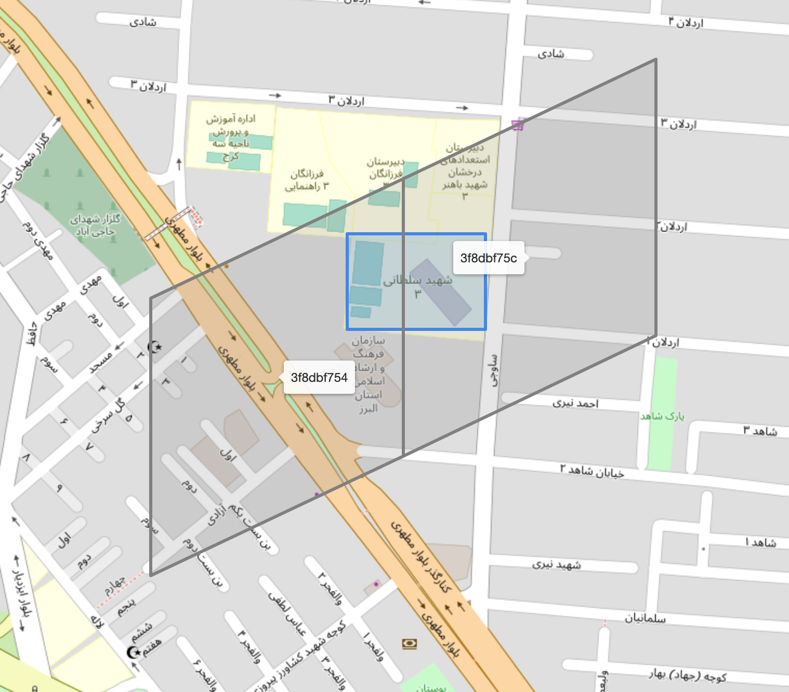
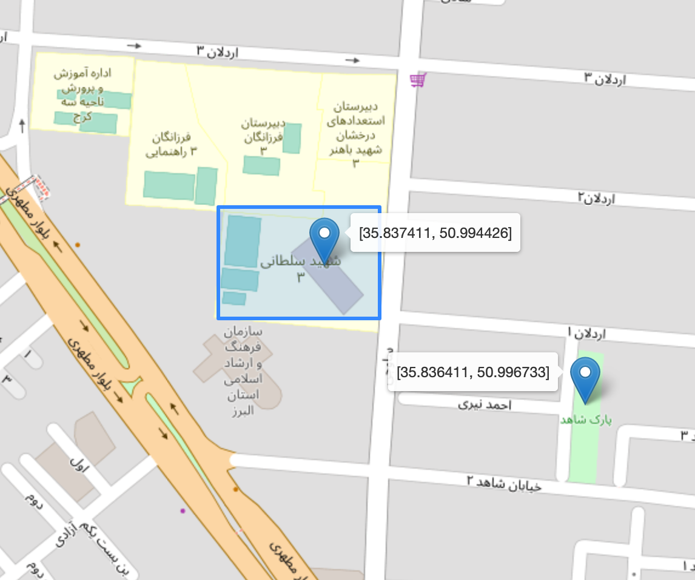
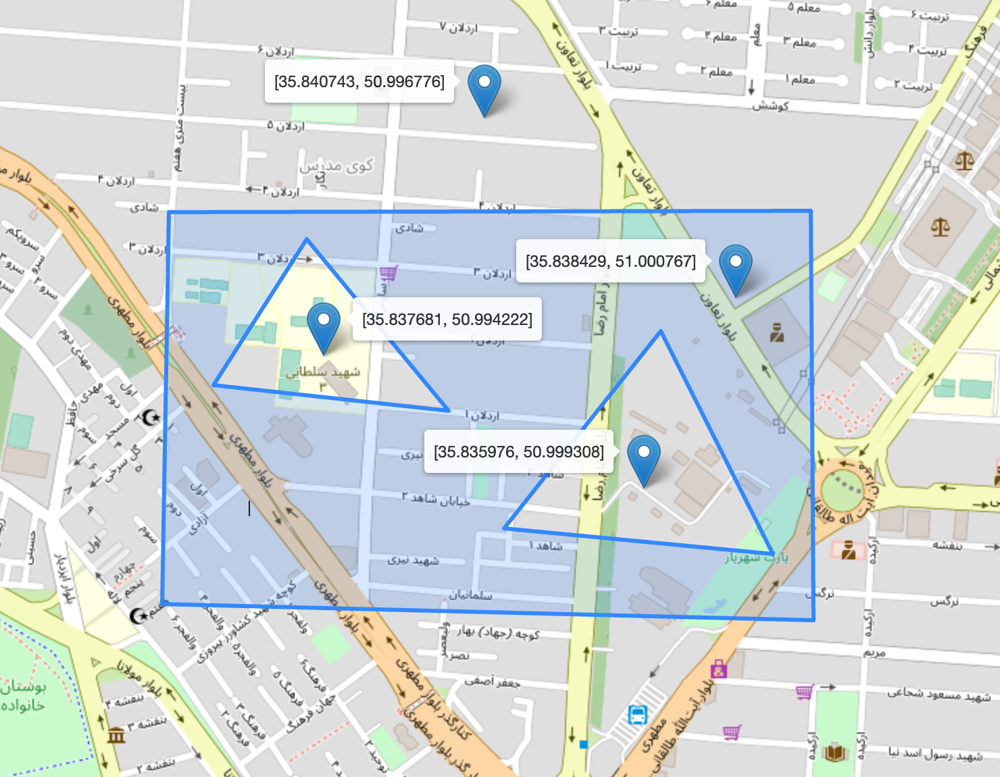
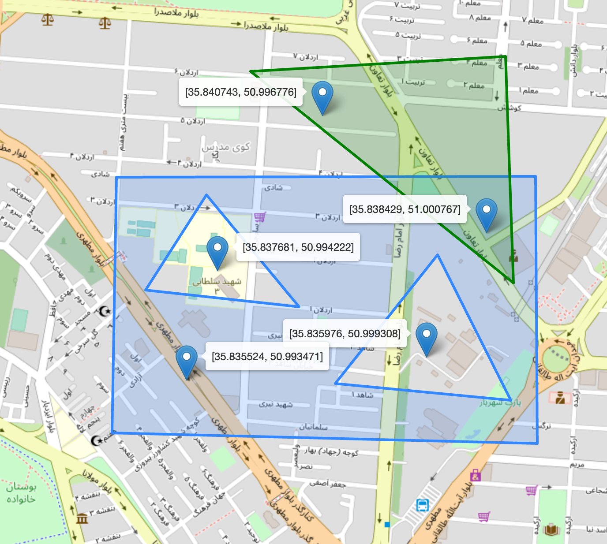

# Geo Lookups

[![Build Status][1]][2]
[![codecov][3]][4]
[![MIT Licence][5]][6]
[](https://pkg.go.dev/github.com/4lie/lookups)

## Introduction

Fast and in-memory geo lookup library.

Simply add polygons and run queries.
It uses Google's S2 Library for indexing and it's super fast :rocket:.

## Usage

* Install

``` bash
go get github.com/4lie/lookups
```

[1]: https://img.shields.io/travis/4lie/lookups?logo=travis&style=flat-square
[2]: https://travis-ci.org/4lie/lookups
[3]: https://img.shields.io/codecov/c/gh/4lie/lookups?logo=codecov&style=flat-square
[4]: https://codecov.io/gh/4lie/lookups
[5]: https://img.shields.io/github/license/4lie/lookups?style=flat-square
[6]: https://opensource.org/licenses/mit-license.php

## Examples
`lookups_test.go` contains several useful examples. You can check visualizations of them here.

| Image                                       | Description                |
|---------------------------------------------|----------------------------|
|  | How indexing works         |
|      | Simple polygon example     |
|      | Polygon with holes example |
|      | Multiple polygons example  |
